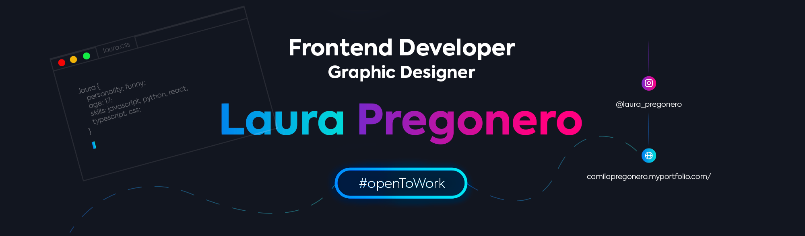

<h3 align="left">Connect with me:</h3>

<h1 align="center">¡Howdy!</h1>
<h2 align="center" >🌹 I'm Laura Pregonero🌹</h2>

<h3 align="center">It's a pleasure to have you on my page or Github. I have been a Frontend developer for two years, I have good management of react, sass, css, html, Tailwind among others, on the other hand, I have been a graphic designer since I was 12 years old, I know illustration, animation, montages and branding. My handling of the adobe suite is magnificent. I am currently going to be 18 years old and it will be a pleasure for you to know a little more about me</h3>

- 🔭 I’m currently working on [Graphic Designer](https://www.instagram.com/dr.arenasantiedad/)

- 📝 I regularly write articles on [https://camilapregonero.myportfolio.com/about-me](https://camilapregonero.myportfolio.com/about-me)

- 📫 How to reach me **laurapregonero@gmail.com**

- ⚡ **I´m extroverted, relaxed, joking, funny and smiling. Your good friend from crazy trips**

<h3 align="left">Languages and Tools:</h3>

 
 

 
  
                

# laurapregonero
